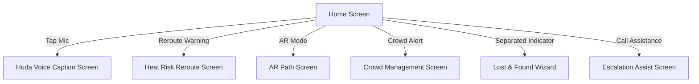

# Stitch Project: Munis Hero Experience
**Project ID:** `5970336127667551620`  
**Device Type:** `MOBILE`  
**Visibility:** `PUBLIC`  

---

## 1. Mobile App Screen Flow & Information Architecture
This project defines the in-screen navigation, interactive states, and mobile features represented in the companion app:

### Detailed Screen Behaviors:
1. **Home Screen**:
   - Simple, high-contrast dashboard displaying current pilgrim location status.
   - Core card displaying the current Hajj/Umrah ritual stage.
   - Prominent microphone action trigger at the bottom for quick companion activation.
2. **Voice Screen (Huda Interaction)**:
   - Voice assistant transcript panels indicating active listening/speaking modes.
   - Dynamic bilingual voice bubble with real-time waveform bars (`.waveform-bar`).
3. **Heat Screen (Step-Free Safety)**:
   - High-temperature alert banners.
   - Step-free path recommendations with shading/cooling station highlights.
4. **Route Screen (AR Path)**:
   - Dynamic 3D/AR overlay arrows guiding the pilgrim toward their next location.
   - Distance indicators and step checklists.
5. **Crowd Screen (Density Rerouting)**:
   - High-density crowd warning badge (e.g., Jamarat route).
   - Quiet path alternative prompt.
6. **Lost Screen (Separated Pilgrim Wizard)**:
   - "Group Leader Lost" state.
   - Dynamic contact actions and offline coordinate sharing.
7. **Assist Screen (Operator Connection)**:
   - Direct escalation button to contact verified guides or emergency responders.

## 2. In-App Navigation, Cards & Controls
- **Mock Smartphone Frame**:
  - Rounded chassis (`42px` radius) matching modern mobile hardware.
  - Top status bar: Time (`09:41`), network signal, Wi-Fi, and battery icons.
  - Notch dimensions (`74px` width, `18px` height) to frame the camera lens.
- **Huda Companion Bar**:
  - Embedded header indicating current voice state: `active`, `listening`, or `understanding`.
  - Offline sync badge (`Synced`) for network-independent reliability.
- **Controls**:
  - Large button actions (`.ph-btn`) with support for icon indicators.
  - Accessibility modes: *Wheelchair Mode*, *Visual Assistance*, and *Simplified Language*.
