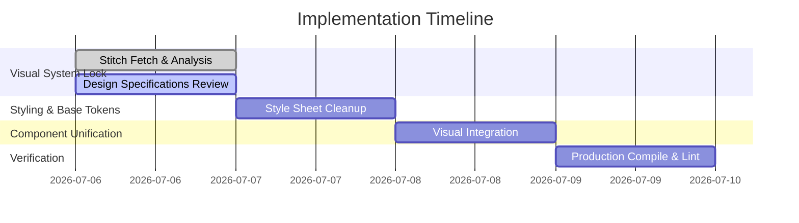

# Stitch Design Implementation Plan

This document maps out the technical tasks to align the existing React components of the Mu'nis repository with the design specifications fetched from both Stitch projects.

---

## 1. Existing Component Mapping & Actions
Based on our inspection of the codebase:

| Component Path | Stitch Ownership | Action required |
| :--- | :--- | :--- |
| `src/components/navigation/Header.tsx` | Website project | **Preserve Navigation Logic**: Retain active scroll spy, drawer states, and language settings. **Restyle**: Update backdrop blurs and focus indicators. |
| `src/components/hero/Hero.tsx` | Website project | **Restyle**: Ensure background light transitions match Sakinah Horizon gradients. |
| `src/components/about/About.tsx` | Website project | **Preserve**: Keep three core pilgrim principles. |
| `src/components/challenge/Challenge.tsx` | Website project | **Restyle**: Ensure Midnight Navy panel contrasts. |
| `src/components/solution/SolutionFlow.tsx` | Website project | **Preserve**: Keep structural steps. |
| `src/components/solution/CapabilityMaturity.tsx` | Website project | **Restyle**: Adapt engine state rings and live context icons. |
| `src/components/ar/ARMaps.tsx` | Application project | **Preserve AR Simulation**: Maintain device camera logic. **Restyle**: Unified Horizon layout mapping. |
| `src/components/accessibility/AccessibilitySection.tsx`| Application project | **Preserve**: Keep card descriptions. |
| `src/components/prototype/PrototypeDemo.tsx` | Application project | **Preserve States**: Maintain offline toggles. **Restyle**: Rebrand buttons. |
| `src/components/common/PhoneFrame.tsx` | Shared system | **Restyle**: Update mock smartphone frame. |
| `src/components/brand/MunisLockup.tsx` | Shared system | **Preserve**: Real HTML text wordmark structures. |

---

## 2. Expected Files to Change
We expect the following files to be modified to align fully with the unified design rules:
1. `src/styles/tokens.css` (Confirm final alignment of SAKINAH HORIZON design colors)
2. `src/components/brand/brand.css` (Rebrand primary wordmark color definitions)
3. `src/components/common/phone.css` (Update phone body background and card surfaces)
4. `src/components/navigation/navigation.css` (Fix focus rings and mobile drawer backdrops)
5. `src/components/ar/armaps.css` (Rebrand AR indicators)
6. `src/components/solution/solution.css` (Rebrand capability selector tabs)
7. `src/components/footer/footer.css` (Rebrand background radial gradient to Sakinah Horizon)

---

## 3. Implementation Stages

### Stage 1: Design Specs Lock (Current Stage)
- List Stitch projects and fetch screen contexts.
- Write the four design specification files inside the repository.
- Await user approval.

### Stage 2: Color and Typography Cleanups
- Review `tokens.css` to verify that all SAKINAH HORIZON tokens match specifications.
- Clean up any stray inline colors in CSS and components.

### Stage 3: Component Visual Integration
- Update stylesheets (`brand.css`, `phone.css`, `navigation.css`, `armaps.css`, `solution.css`) to use unified CSS variables directly.
- Verify color contrast levels inside the mock phone screens.

### Stage 4: Build Verification & Testing
- Validate code compilation using `npm run build`.
- Validate code quality using `npm run lint`.
- Verify RTL layouts in Arabic translation views.

---

## 4. Risks and Mitigation
- **Contrast Ratios**: The Sakinah Horizon colors (such as Mist Blue text on Moon Ivory backgrounds) might trigger light contrast warnings. *Mitigation:* Ensure text weights are bolded or fall back to darker Slate/Indigo shades for small font sizes.
- **RTL Alignment Breakages**: Standard CSS margins (`margin-left`) can break layout direction shifts. *Mitigation:* Enforce logical CSS properties (`margin-inline-start`, `padding-inline`) at all times.
